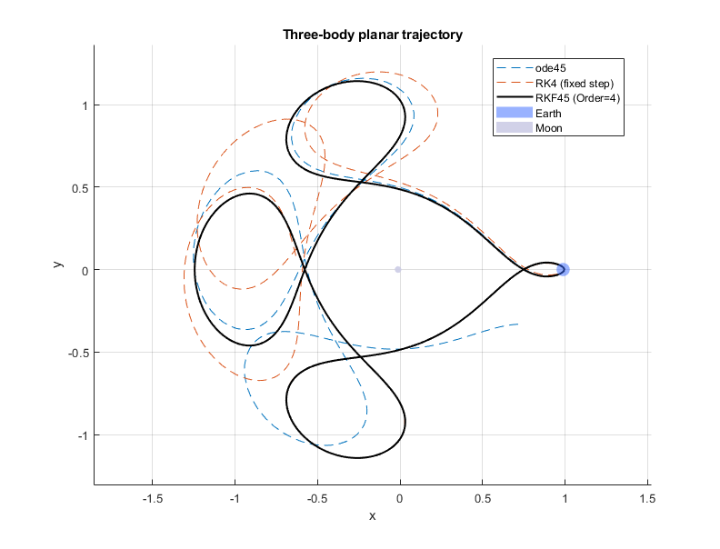

# ODEs-and-solvers

Some classic differential equations and basic numerical solvers

- **Solvers**: Explicit Euler (EE), Implicit Euler (IE), Trapezoid / Crank–Nicolson (TRAP), Runge–Kutta 4 (RK4).  
- **Models**: Lotka–Volterra (LV), van der Pol (VDP), Rayleigh oscillator, and a stiff scalar test (StiffEqn).  
- **Utils**: A plotting helper to compare phase portraits and time series across solvers.  
- **Newton**: Newton–Raphson iteration with a numerical Jacobian (used by IE/TRAP).





## Quick start

Run `demo`, it will the models and solvers to the MATLAB path, calls two different solvers for the same system and plots their results.
All solvers expect a right-hand side f(t,y) that returns a column vector the same size as y. Each model keeps its parameters at the **top of the file** for easy tweaking.
You can run your own model by creating `models/MySystem.m`:
```matlab
function f = MySystem(t, y)
% y is a column vector; return a column vector
% Example: y1' = y2, y2' = -y1
f = [y(2); -y(1)];
end
```

Then call any solver:
```matlab
[t, y] = SOLVER(@model, tspan, h, y0);
```

## Environment:

MATLAB R2018a+ recommended (uses basic language features).

No toolboxes required beyond base MATLAB.
